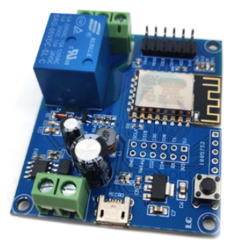
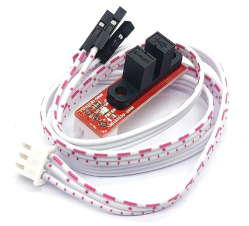

# Controlador do Relógio da Torre baseado no ESP8266 

## Módulo ESP8266 Wireless WIFI Relay Controller

Esta aplicação foi construído inicialmente para plaquinha ESP12, porém, agora estou 
adaptando-a para usar uma plaquinha do ESP8266 que já vem com um relé. 

Apesar de poder ser alimentado com uma voltagem entre 5V e 80V, os microcontrolador com apenas 3,3V. Um conversor 
é necessário quando precisa se integrar com módulos sensores que esperam outras voltagens.

Descrição:
- ESP8266 Wireless WIFI Relay Controller Module Single-channel Relay Module ESP 12F Development Board for IOT Smart Home DC5V-80V

O link no qual eu comprei foi:

https://www.aliexpress.com/item/1005002907740418.html

## Sensores óticos

O projeto utiliza dois sensores óticos. Um para o disco dos minutos e outro para os discos das horas.

O módulo com o sensor ótico é o "3D Printer Optical Endstop TCST2103 Optical Control Limit Optical Switch RAMPS 1.4". 
Ele funciona com 5V e é necessário usar um conversor de 5V-3V3 para ele se conectar ao módulo do ESP8266.

#### Pinos

    nodemcu | board   | Function
    --------|---------|-----------------------------------
      0     | GPIO 16 | LED onboard (HIGH-off / LOW-on)
      1     | GPIO 5  | Relay onboard (HIGH-on / LOW-off)
      2     | GPIO 4  | não usado - (recomendado para Relé além do GPIO 5)
      3     | GPIO 0  | não usado - (melhor não usar para INPUT, pois, usa para entrar no flash)
      4     | GPIO 2  | não usado - (melhor não usar para INPUT, pois, usa para entrar no flash)
      5     | GPIO 14 | signal sensor ótico - Minutos
      6     | GPIO 12 | signal sensor ótico - Horas
      7     | GPIO 13 |
      8     | GPIO 15 | não usado - (melhor não usar para INPUT, pois, usa para entrar no flash)
      9     | GPIO 3  |
     10     | GPIO 1  |
     11     | GPIO 9  |
     12     | GPIO 10 |

## BUILDING FIRMWARE 

Primeiro, deve-se fazer as mudanças nos arquivos de header (.h)
como o user_config.h, user_modules.h e outros. Os arquivos que
alterei para o projeto do  relógio estão na mesma página que esse
`LEIAME.md`.

#### user_config.h

    Index: app/include/user_config.h
    @@ -50,7 +50,7 @@
    -//#define LUA_NUMBER_INTEGRAL
    +#define LUA_NUMBER_INTEGRAL
    @@ -79,7 +79,7 @@
    -//#define LUA_FLASH_STORE                   0x10000
    +#define LUA_FLASH_STORE                   0x10000
    @@ -111,7 +111,7 @@
    -//#define SPIFFS_MAX_FILESYSTEM_SIZE 0x20000
    +#define SPIFFS_MAX_FILESYSTEM_SIZE 0x100000
    
    @@ -189,7 +189,7 @@
    -#define ENDUSER_SETUP_AP_SSID "NodeMCU"
    +#define ENDUSER_SETUP_AP_SSID "esp-12 SMCF"

#### user_modules.h

    -#define LUA_USE_MODULES_ADC
    +//#define LUA_USE_MODULES_ADC
    -#define LUA_USE_MODULES_DHT
    +//#define LUA_USE_MODULES_DHT
    -//#define LUA_USE_MODULES_ENCODER
    +#define LUA_USE_MODULES_ENCODER
    -//#define LUA_USE_MODULES_HTTP
    +#define LUA_USE_MODULES_HTTP
    -#define LUA_USE_MODULES_I2C
    +//#define LUA_USE_MODULES_I2C
    -#define LUA_USE_MODULES_MQTT
    +//#define LUA_USE_MODULES_MQTT
    -#define LUA_USE_MODULES_OW
    +//#define LUA_USE_MODULES_OW
    -//#define LUA_USE_MODULES_RTCTIME
    +#define LUA_USE_MODULES_RTCTIME
    -//#define LUA_USE_MODULES_SJSON
    +#define LUA_USE_MODULES_SJSON
    -//#define LUA_USE_MODULES_SNTP
    +#define LUA_USE_MODULES_SNTP
    
## nodemcu-build.com

1. vá até https://nodemcu-build.com/.

2. Escolher os módulos:

 bit encoder file gpio http net node rtctime sjson sntp spi timer uart wifi.

3. LFS options:

- LFS Size: 128KB
- SPIFFS base: 0, start right after firmware
- SPIFFS size: all free flash

4. Aguarde o aviso por e-mail e realize o download. 

5. Faz o upload no ESP8266 usando o comando:

_(powershell)_

    esptool.py --port COM3 write_flash -fm dio 0x00000 C:\Users\smarc\Downloads\nodemcu-release-14-modules-2021-11-27-23-49-50-integer.bin
    esptool.py --port COM3 write_flash -fm dio 0x00000 D:\smarc\Projetos\github\smarcelobr\relogioBPICM\building_firmware\nodemcu-release-14-modules-2021-12-20-22-38-55-integer.bin

## RASPBERRY PI (*nux)

Comandos para compilar o firmware do nodemcu no RASPBERRY:

    $ export PATH=$PATH:/home/pi/aplicativos/esp8266-linux-arm_32-20191111.0/bin

    $ make TOOLCHAIN_ROOT=~/xtensa/esp8266-linux-arm_32-20191111.0/

(ref.: https://github.com/nodemcu/nodemcu-firmware/issues/2958)

### FLASHING FIRMWARE (raspi)

Para saber o tamanho do FLASH: (juntar GPIO0 e GND se não for via USB)

    $ cd /home/pi/.local/lib/python3.7/site-packages
    $ python3.7 esptool.py --port /dev/ttyUSB0 flash_id

Para fazer a gravação do firmware (flashing):

    esptool.py --port <serial-port-of-ESP8266> write_flash -fm <flash-mode> 0x00000 <nodemcu-firmware>.bin

    $ cd /home/pi/.local/lib/python3.7/site-packages
    $ python3.7 esptool.py --port /dev/ttyUSB0 write_flash -fm dio 0x00000 /home/pi/github/nodemcu-firmware/bin/0x00000.bin
    $ esptool.py --port /dev/ttyUSB0 write_flash -fm dio 0x10000 /home/pi/github/nodemcu-firmware/bin/0x10000.bin

### Fazendo a imagem do LFS (raspi)

    $ cd /home/pi/esp8266/projetos/relogioBPICM/lfs
    $ /home/pi/github/nodemcu-firmware/luac.cross.int -o lfs.img -f *.lua

#### UPLOAD arquivos para SPIFFS (raspi)

    $ nodemcu-tool upload --port=/dev/ttyUSB0 lfs.img

Toda a vez que atualizar a imagem do LFS, deve executar o seguinte comando no nodemcu:

_(terminal do nodemcu)_

    > node.flashreload("lfs.img")

uma alternativa para executar o comando acima usando o nodemcu-tool:

    $ nodemcu-tool --port=/dev/ttyUSB0 run reload_lfs.lua

O nodemcu vai resetar automaticamente.

---
## WINDOWS 10 e Docker 

Instruções no link: https://nodemcu.readthedocs.io/en/master/build/
e https://hub.docker.com/r/marcelstoer/nodemcu-build/

### TESTAR A CONEXÃO COM ESP8266 (win)

NATALENE (power shell):
    
     PS C:\Users\smarc> esptool.py.exe --port COM3 flash_id
     esptool.py v3.0
     Serial port COM3
     Connecting....
     Detecting chip type... ESP8266
     Chip is ESP8266EX
     Features: WiFi
     Crystal is 26MHz
     MAC: 5c:cf:7f:18:d0:70
     Uploading stub...
     Running stub...
     Stub running...
     Manufacturer: e0
     Device: 4016
     Detected flash size: 4MB
     Hard resetting via RTS pin...

### NOVO FIRMWARE 

1) Abrir o PowerShell e ir na pasta onde está o clone de https://github.com/nodemcu/nodemcu-firmware

> D:
> cd \smarc\ESP8266\nodemcu-firmware

2) executar o comando:

#### XPTO bash

    $ docker run --rm -ti -v D:\\smarc\\ESP8266\\nodemcu-firmware:/opt/nodemcu-firmware marcelstoer/nodemcu-build build
    docker run --rm -ti -v c:\\Users\\Public\\trabalho\\projetos\\github\\nodemcu-firmware:/opt/nodemcu-firmware marcelstoer/nodemcu-build build

#### Xeonling Powershell

    docker run --rm -ti -v D:\smarc\Projetos\github\nodemcu\nodemcu-firmware:/opt/nodemcu-firmware marcelstoer/nodemcu-build build

-- alternativa caso a pasta atual ($pwd) já seja a do firmware :

    docker run --rm -ti -v ${pwd}:/opt/nodemcu-firmware marcelstoer/nodemcu-build build

#### NATALENE PowerShell:

    docker run --rm -ti -v c:\Users\smarc\esp8266\nodemcu-firmware:/opt/nodemcu-firmware marcelstoer/nodemcu-build build

_( No windows, o Docker só irá conseguir fazer o mount de "D:\\smarc\\ESP8266\\nodemcu-firmware" se
ele for uma das pastas da lista de sharing das configurações do Docker Desktop.)_

#### NATALENE Ubuntu terminal

    $ cd /home/sergio/IdeaProjects/relogioBPICM/lfs/
    $ //mnt/c/Users/smarc/esp8266/nodemcu-firmware/luac.cross.int -o ../out/lfs.img -f *.lua

3) pegar os dois binários que estarão na pasta D:\smarc\ESP8266\nodemcu-firmware\bin
- 0x00000.bin will contain just the firmware.
- 0x10000.bin will contain the SPIFFS.

### FLASHING FIRMWARE 

Análogo ao do Raspberry, usando o esptool.py

_(powershell ou cmd)_

    > esptool.py --port COM3 write_flash -fm dio 0x00000 D:\smarc\ESP8266\nodemcu-firmware\bin\0x00000.bin
    > esptool.py --port COM3 write_flash -fm dio 0x10000 D:\smarc\ESP8266\nodemcu-firmware\bin\0x10000.bin

#### NATALENE PowerShell:

    $ esptool.py --port COM3 write_flash -fm dio 0x00000 c:\Users\smarc\esp8266\nodemcu-firmware\bin\0x00000.bin
    $ esptool.py --port COM3 write_flash -fm dio 0x10000 c:\Users\smarc\esp8266\nodemcu-firmware\bin\0x10000.bin

Alternativa, gravando o binário completo:

    esptool.py --port COM3 write_flash -fm dio 0x00000 c:\Users\smarc\esp8266\nodemcu-firmware\bin\nodemcu_integer_release_20201227-2216.bin

Apagar o flash antes de gravar pode corrigir problemas de boot

    esptool.py --port COM3 erase_flash

#### NOVO LFS 

    > docker run --rm -ti -v D:\\smarc\\ESP8266\\nodemcu-firmware:/opt/nodemcu-firmware -v D:\\smarc\\IdeaProjects\\relogioBPICM\\lfs:/opt/lua marcelstoer/nodemcu-build lfs-image

NATALENE:

    docker run --rm -ti -v c:\Users\smarc\esp8266\nodemcu-firmware:/opt/nodemcu-firmware -v \\wsl$\Ubuntu\home\sergio\IdeaProjects\relogioBPICM\lfs:/opt/lua marcelstoer/nodemcu-build lfs-image

XeonLing POWERSHELL:

    cd D:\smarc\Projetos\github  (<--pasta atual = $pwd)
    docker run --rm -ti -v ${pwd}\nodemcu\nodemcu-firmware:/opt/nodemcu-firmware -v ${pwd}\smarcelobr\relogioBPICM\lfs:/opt/lua marcelstoer/nodemcu-build lfs-image

#### Uploading files to SPIFFS 

Igual ao do raspberry, usando o nodemcu-tool.

    > cd D:\smarc\IdeaProjects\relogioBPICM\lfs
    > nodemcu-tool upload --port=COM3 LFS_integer_20200921-0058.img --remotename lfs.img
    > nodemcu-tool -p COM3 run reload_lfs.lua
   
ou, no terminal do nodemcu:

    > print(node.LFS.reload("lfs.img"))
    > old: node.flashreload("lfs.img")

---

## NATELENE build script (folder out)

### [No terminal Ubuntu]

    $ cd /home/sergio/IdeaProjects/relogioBPICM
    $ ./build.sh

Esse build.sh copia para a pasta ./out todos os arquivos necessários já compactados e o lua.img já feito.

## NATALENE transfer project files

Para transferir para o nodemcu, tem que ser pelo PowerShell através dos comandos abaixo:

### [No Powershell]

    $ cd \\wsl$\Ubuntu\home\sergio\IdeaProjects\relogioBPICM
    $ nodemcu-tool upload --port=COM3 ./out/lfs.img
    $ nodemcu-tool upload --port=COM3 ./out/*.gz
    $ nodemcu-tool upload --port=COM3 ./out/*.lua
    $ nodemcu-tool upload --port=COM3 ./out/*.json

---

## Comandos uteis para usar no terminal com o ESP8266 

Para acionar o terminal:

    $ nodemcu-tool -p COM3 -b 115200 terminal

_se o baudrate for diferente:_

    $ nodemcu-tool -p COM3 -b 74880 terminal

Listar arquivos: (requer util.lua)

$ dofile("util.lua")    
$ listfs()

Excluir um arquivo:

    $ file.remove("lfs.img")

Renomear Arquivo:

    file.rename("LFS_integer_20200921-0020.img","lfs.img")

desligar o motor:

	gpio.mode(1,gpio.OUTPUT);
	gpio.write(1,gpio.HIGH);
	gpio.mode(2,gpio.OUTPUT);
	gpio.write(2,gpio.HIGH)

cancelar a execução ao iniciar:

    file.rename('ok.flag','not_ok.flag')

retomar a execução normal:

    file.rename('not_ok.flag','ok.flag'); node.restart()

para acertar o ssid do wifi:

    -- em casa
    cfg.set({'wifi','sta','ssid'}, 'jardimdomeier'); cfg.set({'wifi','sta','pwd'}, 'xxx'); node.restart()

    -- na igreja
    cfg.set({'wifi','sta','ssid'}, 'BICM TORRE'); cfg.set({'wifi','sta','pwd'}, 'xxx'); node.restart()

modo do wifi:

    print(wifi.getmode());
    print(wifi.sta.getstatus());
    print(wifi.sta.getip())

Resolver DNS:

    net.dns.resolve("www.cachambi.com.br", function(sk, ip)
        if (ip == nil) then print("DNS fail!") else print(ip) end
    end)

Reiniciar o nodemcu:

    node.restart()

